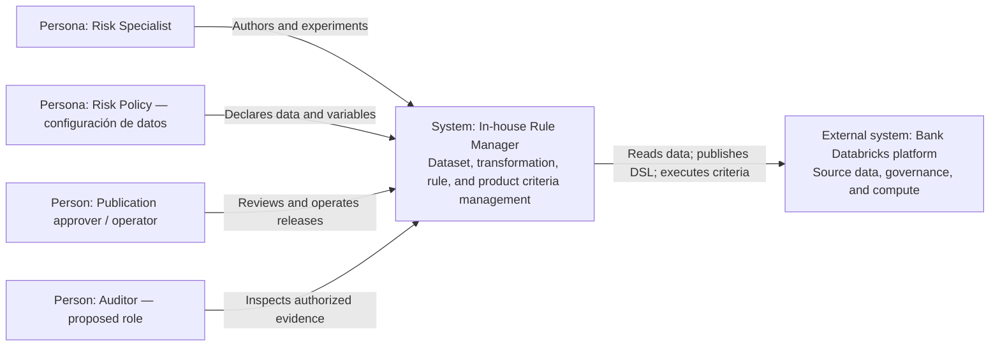

> HISTÓRICO — boceto sustituido; no usar para implementación. Ver [modelo LikeC4 vigente](architecture.c4) y [guía de vistas](README.md). Incluye decisiones antiguas deliberadamente conservadas como historial.

# C4 level 1 — system context

Databricks is an external platform dependency of the logical Rule Manager system even though it hosts the App and execution runtime. El alcance termina en la tabla de resultados; no incluye sistemas consumidores externos.
