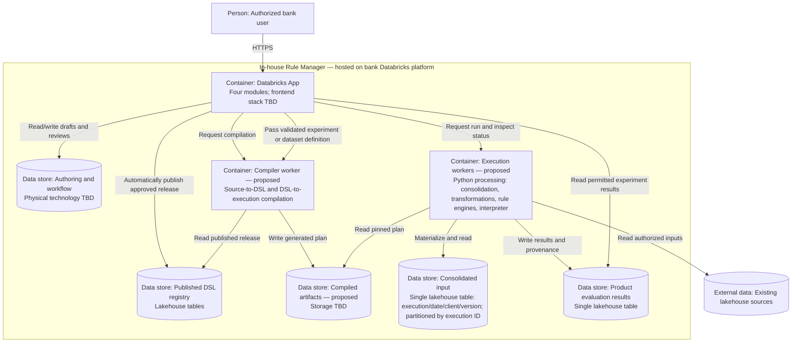

> HISTÓRICO — boceto sustituido; no usar para implementación. Ver [modelo LikeC4 vigente](architecture.c4) y [guía de vistas](README.md). Incluye decisiones antiguas deliberadamente conservadas como historial.

# C4 level 2 — containers

Experiment snapshots may be passed directly to the compiler; only production releases must be published in the DSL registry. Registry reads by the compiler refer to published releases. Arrows describe responsibilities, not final transport protocols. Production runs are scheduled batches; experiments run on demand. Identity integration remains to be designed.
