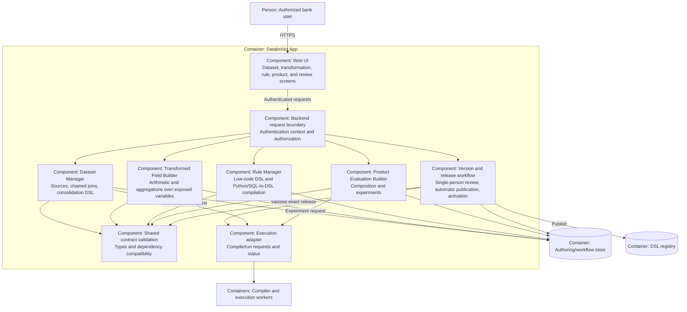

> HISTÓRICO — boceto sustituido; no usar para implementación. Ver [modelo LikeC4 vigente](architecture.c4) y [guía de vistas](README.md). Incluye decisiones antiguas deliberadamente conservadas como historial.

# C4 level 3 — Databricks App components

All components are proposed internal boundaries in one App, not independently deployed services. Backend authorization applies to each operation, including execution requests. Workers enforce their own resource permissions.
